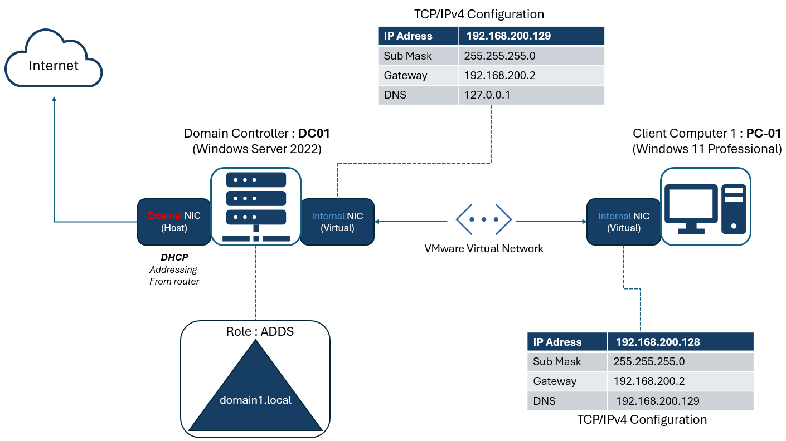
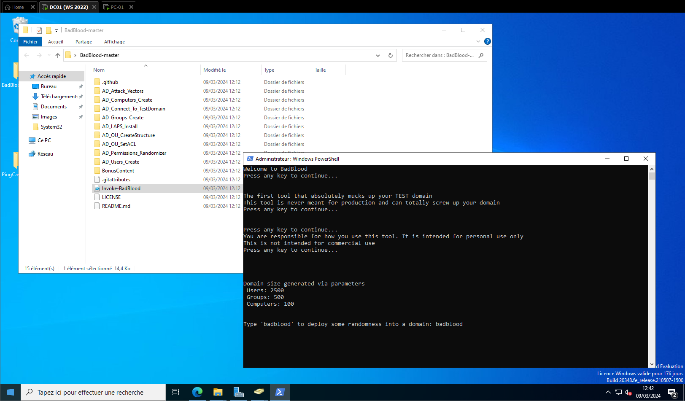
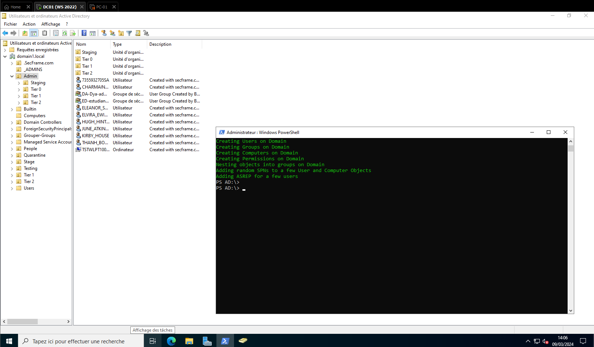
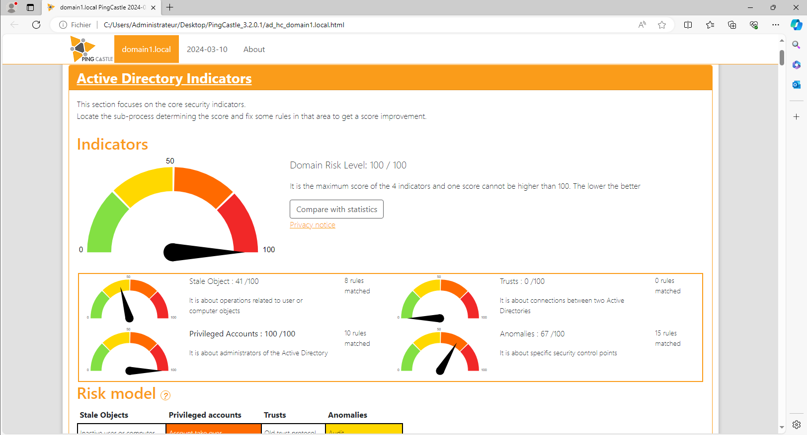

# Active-Directory home lab 

*Purpose:* The goal of this project is to establish and configure an Active Directory environment from scratch using virtual machines (VMs), with a focus on securing it using AD hardening techniques, Powershell scripts and tools such as PingCastle.

## Home lab Setup :

First let’s create our first Active Directory Home lab using VMs here I’m going to use the Hypervisor VMware and install 1 Windows Servers VMs (2022 and 2019) and 1 Windows 11 VMs.

### *VM intallation tips :*

*- Windows cannot find the Microsoft Liscence : VM settings → Floppy → Unselect “connect at power on” → reboot your VM*

*- To install VMware tools : VM settings → Select Floppy → Remove*

- # Our First domain :

It’s time to create our first Domain based on this scheme :




- **DC01 configuration :**
    - Change the IP adress/DC name (if you want)
    - Install the **ADDS role**
    - Promote the Windows server to a DC :
        - Create a new forest (new domain named ***domain1.local***)
    - Create a user account
- **PC01 configuration :**
    - Link the client to the DC :
        - Go to “about this PC (advanced)” enter the domain name and choose an account to link with the DC.
        - You can now connect to the PC with the account created in the DC
     
- # Populate our Active directory :

Now our active directory is setup, but it's empty, its time to populate our AD using a tool named Badblood : https://github.com/davidprowe/BadBlood?tab=readme-ov-file

BadBlood fills a Microsoft Active Directory Domain with a structure and thousands of objects. The output of the tool is a domain similar to a domain in the real world which is perfect for our lab.

Once the Badblood repository is on your Desktop, we can bypass the execution policy and then run the script :

```powershell
Set-ExecutionPolicy bypass
.\Invoke-BadBlood.ps1
```

It can take some time… :



And here is the result, with new OUs , groups and users :




Now that our domain is populated, it's time to check the health of our AD using ping castle. Once installed, run the tool and check the results:



The ping castle scan is pretty bad, and the domain's risk level is 100/100, which is not good news. Our aim is to reduce this score by reinforcing the AD.

## Conclusion

By following these steps, you can create an Active Directory Home Lab. This setup will allow you to understand how an AD works, practice offensive techniques and improve your skills in securing an Active Directory environment.
